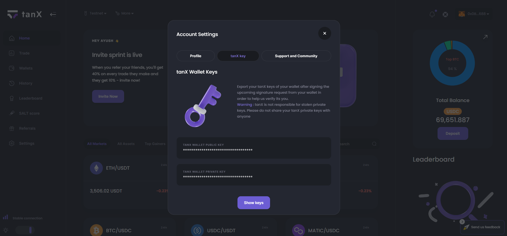

<h1 align="center">tanX Connector Python</h1>

<p align="center">
  The official Python connector for <a href="https://docs.tanx.fi/tech/api-documentation">tanX's API</a> 🚀
</p>

<!-- <div align="center">

  [](https://www.npmjs.org/package/@tanx-fi/tanx-connector)
  [](https://github.com/tanX-Finance-Libs/tanX-connector-nodejs/actions/workflows/main.yml)
  [](https://bundlephobia.com/package/@tanx-fi/tanx-connector@latest)

</div> -->


## Features

- Complete endpoints including REST and WebSockets
- Methods return parsed JSON.
- High level abstraction for ease of use.
- Easy authentication
- Automatically sets JWT token internally
- Auto refresh tokens when access token expires

Tanx-connector-python includes utility/connector functions which can be used to interact with the Tanx API. It uses requests internally to handle all requests.

## Table of Contents

- [Features](#features)
- [Table of Contents](#table-of-contents)
- [Installation](#installation)
- [Quickstart](#quickstart)
- [Getting Started](#getting-started)
  - [Workflow](#workflow)
  - [L2 Key Pair](#l2-key-pair)
  - [Rest Client](#rest-client)
  - [General Endpoints](#general-endpoints)
    - [Test Connectivity](#test-connectivity)
    - [24hr Price](#24hr-price)
    - [Kline/Candlestick Data](#klinecandlestick-data)
    - [Order Book](#order-book)
    - [Recent trades](#recent-trades)
    - [Login](#login)
    - [Refresh Token](#refersh-token)
    - [Logout](#logout)
    - [Profile Information (Private 🔒)](#profile-information-private-)
    - [Balance details (Private 🔒)](#balance-details-private-)
    - [Profit and Loss Details (Private 🔒)](#profit-and-loss-details-private-)
    - [Create order (Private 🔒)](#create-order-private-)
    - [Get Order (Private 🔒)](#get-order-private-)
    - [List Orders (Private 🔒)](#list-orders-)
    - [Cancel Order (Private 🔒)](#cancel-order-private-)
    - [List Trades (Private 🔒)](#list-trades-private-)
  - [WebSocket Client](#websocket-client)
    - [Connect](#connect)
    - [Subscribe](#subscribe)
    - [Unsubscribe](#unsubscribe)
    - [Disconnect](#disconnect)
    - [Usage](#usage)
  - [Error Handling](#error-handling)
  - [Internal Transfer](#internal-transfer)
  - [Deposit](#deposit)
    - [Ethereum Network Deposit](#ehtereum-network-deposit)
    - [Polygon Network Deposit](#polygon-network-deposit)
    - [List Deposits](#list-deposits)
  - [Withdrawal](#withdrawal)
    - [Normal Withdrawal](#normal-withdrawal)
    - [Fast Withdrawal](#fast-withdrawal)

## Installation

First go to the [tanX Website](https://www.tanx.fi/) and create an account with your wallet.

Install the package using pip.

```python
pip install tanx-connector
```

## Quickstart

Make sure that tanxconnector is [installed](#installation) and up-to-date.
Also make sure you have an account on the [mainnet](https://www.tanx.fi/) or [testnet](https://api-testnet.tanx.fi) website.

To get quickly started, try running the simple example for creating and fetching the order once logged in.

```python
from tanxconnector import Client

ETH_ADDRESS = "(your eth wallet address)"
PRIVATE_KEY = "(your wallet's private key)"

client = Client()

# login to the network
login = client.complete_login(ETH_ADDRESS, PRIVATE_KEY)

# create an order nonce
nonce: CreateOrderNonceBody = {'market': 'ethusdc', 'ord_type':'market', 'price': 29580.51, 'side': 'sell', 'volume': 0.0005}

# create the order
order = client.create_complete_order(nonce, stark_private_key)
print(order)

# fetch the details of the order just created
order_id = order['payload']['id']
fetch_order = client.get_order(order_id)
print(fetch_order)
```

## Getting Started

The default base url for mainnet is https://api.tanx.fi and testnet is https://api-testnet.tanx.fi. You can choose between mainnet and testnet by providing it through the constructor. The default is mainnet. All REST apis, WebSockets are handled by Client, WsClient classes respectively.

### Workflow

Check out the [example files](./example) to see an example workflow.

### L2 Key Pair

L2 Key Pair generation isn't currently available in the TanX Python SDK. 

To get the L2 Key Pair, follow any of the two steps:

1. Get the Key Pair from the [TanX official website](https://trade.tanx.fi/)'s Account Settings Tab once wallet is connected. Refer to the image below for more reference. Click on `Settings -> tanX key -> Show Keys` and Sign the request to get the keys. Copy these keys and store it securely.


2. Generate the L2 key pair using the [TanX Nodejs SDK](https://github.com/tanx-libs/tanx-connector-nodejs). For generation using the Node SDK, refer to [this section](https://github.com/tanx-libs/tanx-connector-nodejs#create-l2-key-pair) in the documentation of the Nodejs SDK.

### Rest Client

Import the REST Client

```py
from tanxconnector import Client
```

Create a new instance

```python
client = Client()
# or
client = Client() 
# default is mainnet
```

### General Endpoints

#### Test connectivity

`GET /sapi/v1/health/`

```python
client.test_connection()
```

#### 24hr Price

`GET /sapi/v1/market/tickers/`

```python
client.get_24h_price('btcusdt')
```

#### Kline/Candlestick Data

`GET /sapi/v1/market/kline/`

```python
client.get_candlestick('btcusdt')
```

#### Order Book

`GET /sapi/v1/market/orderbook/`

```python
client.get_orderbook('btcusdt')
```

#### Recent trades

`GET /sapi/v1/market/trades/`

```python
client.get_recent_trades('btcusdt')
```

#### Login

Both login() and complete_Login() sets tokens internally. Optionally, set_access_token() and set_refresh_token() can be used to set tokens directly.

getNonce: `POST /sapi/v1/auth/nonce/`  
login: `POST /sapi/v1/auth/login/`

```python
from tanxconnector import sign_msg, Client

client = Client()

client.complete_login(ETH_ADDRESS, PRIVATE_KEY)  
# calls below functions internally, use this for ease

# or

nonce = client.get_nonce(ETH_ADDRESS)
user_signature = sign_msg(nonce['payload'], PRIVATE_KEY)
login = client.login(ETH_ADDRESS, user_signature)

# or

client.set_access_token(access_token)
client.set_refresh_token(refresh_token)
# these functions are called internally when you use login or complete_login
```

#### Refresh Token

`POST /sapi/v1/auth/token/refresh/`

If refresh token is set (manually or by using login functions), the refresh endpoint is called automatically when access token expires. Optionally, you can call `refresh_tokens` manually by passing in refresh_token (passing it is optional, it'll work if has been set before).

```python
res = client.refresh_tokens(refresh_token)
```

#### Logout

Sets tokens to null

```python
client.logout()
```

#### Profile Information (Private 🔒)

`GET /sapi/v1/user/profile/`

```python
client.get_profile_info()
```

#### Balance details (Private 🔒)

`GET /sapi/v1/user/balance/`

```python
client.get_balance()
```

#### Profit and Loss Details (Private 🔒)

`GET /sapi/v1/user/pnl/`

```python
client.get_profit_and_loss()
```

#### Create order (Private 🔒)

Order is created in 2 steps:

1. Create the order nonce body
2. Process the order nonce body with the stark private key to create the order

Create Nonce Body

```py
from tanxconnector.typings import CreateOrderNonceBody
nonce: CreateOrderNonceBody = {'market': 'btcusdt', 'ord_type': 'market',
                               'price': 29580.51, 'side': 'buy', 'volume': 0.0001}
```

Create Order

create_order_nonce: `POST /sapi/v1/orders/nonce/`  
create_new_order: `POST /sapi/v1/orders/create/`

For getting the L2 Key Pairs (Stark Keys) refer to the above [section](#l2-key-pair) in the documentation.

```python
stark_private_key = '(Your Stark Private Key Here)'

order = client.create_complete_order(nonce, stark_private_key)
# calls below functions internally, we recommend using createCompleteOrder for ease of use

# or

from tanxconnector import sign_order_with_stark_private_key

nonce_res = client.create_order_nonce(nonce)
msg_hash = sign_order_with_stark_private_key(stark_private_key, nonce_res['payload'])
order = client.create_new_order(msg_hash)
```

#### Get Order (Private 🔒)

`GET /sapi/v1/orders/{order_id}/`

```python
client.get_order(order_id)
```

#### List Orders (Private 🔒)

`GET /sapi/v1/orders/`

```python
client.list_orders(
  limit=50,
  page=1,
  market='btcusdc',
  state='wait',
  base_unit='btc',
  quote_unit='usdc',
  start_time=1694785739,
  end_time=1694785839,
  side='buy'
)
```

#### Cancel Order (Private 🔒)

`POST /sapi/v1/orders/cancel/`

```python
client.cancel_order(order_id)
```

#### List Trades (Private 🔒)

`GET /sapi/v1/trades/`

```python
client.list_trades()
```

### WebSocket Client

Import the WebSocket Client. All WsClient methods are asynchronous (use async/await method).

```py
from tanxconnector import WsClient
import asyncio
```

Create a new instance

```python
ws_client = WsClient('public')
// or
ws_client = WsClient('public', 'mainnet')
// default is mainnet
// or
login = client.complete_login(ETH_ADDRESS, PRIVATE_KEY)
ws_client =  WsClient('private', 'mainnet', login['token']['access'])
```

#### Connect

```py
await ws_client.connect()
```

#### Subscribe

```py
streams = [
  'btcusdc.trades',
  'btcusdc.ob-inc',
  'btcusdc.kline-5m',
]
await ws_client.subscribe(streams)

# or for private

await ws_client.subscribe(['trade', 'order'])
```

#### Unsubscribe

```py
streams = [
  'btcusdc.trades',
  'btcusdc.ob-inc',
  'btcusdc.kline-5m',
]
await ws_client.unsubscribe(streams)

# or for private

await ws_client.unsubscribe(['trade', 'order'])
```

#### Disconnect

```py
ws_client.disconnect()
```

#### Usage

WsClient includes a member called websocket which is initialized with websockets.connect(). You may use it to handle WebSocket operations.

```py
async for message in ws_client.websocket:
    print(message)
```

### Error Handling

Errors thrown are of types `AuthenticationError or requests.exceptions.HTTPError`.  

Example

```py
try:
    # call methods
except tanxconnector.exception.AuthenticationError as exc:
    print(exc)
except requests.exceptions.HTTPError as exc:
    print(exc.response.json())
```

### Internal Transfer

Users will be able to seamlessly transfer assets from their CEXs or other chains with minimal fees.

To get started with the feature, follow these two steps:

1. Reach out to tanX (support@tanx.fi) to get the organization key and API key.

2. Generate the L2 key pair with your private key

#### Available methods:

1. To process the internal transfer, call the `intiate_and_process_internal_transfers` method and pass the necessary arguments:

```python
key_pair = {
  'stark_public_key': '(your stark public key here)'
  'stark_private_key': '(your stark private key here)'
}

ETH_ADDRESS_2 = '(destination Eth wallet address here)'

internal_transfer_response = client.intiate_and_process_internal_transfers(
  key_pair=key_pair,
  organization_key=TANX_ORGANIZATION_KEY,
  api_key=TANX_API_KEY,
  currency='usdc',
  amount=1,
  destination_address=ETH_ADDRESS_2,
  client_reference_id=1
)
```

2. Retrieve a list of transfers initiated by the authenticated user:

```python
internal_trasnfers_list = client.list_internal_transfers({
  'limit': 10,
  'offset': 10
})
```

3. Retrieve an internal transfer using its client reference id:

```python
internal_transfer_by_id = client.get_internal_transfer_by_client_id(client_reference_id)
```

4. Check if a user exists by their destination address.

```python
check_user_res = client.check_internal_transfer_user_exists(
  TANX_ORGANIZATION_KEY,
  TANX_API_KEY,
  destination_address,
)
```

### Deposit

#### Ethereum Network Deposit

This method involves using a custom provider and signer, which can be created using the web3.py library. The `stark_public_key` mentioned in the code should be obtained using the steps described in the [L2 Key Pair](#l2-key-pair) section of the documentation. Here's the code snippet for this method:

```python
# Note: Please use web3 version 5.25.0
from web3 import Web3, Account

provider = Web3(Web3.HTTPProvider(RPC_PROVIDER))
signer = Account.from_key(PRIVATE_KEY)

deposit_res_with_stark_keys = client.deposit_from_ethereum_network_with_stark_key(
  signer,
  provider,
  f'0x{stark_public_key}',
  0.0001,
  'usdc'
)
```

#### Polygon Network Deposit

There are two ways to make a deposit on the Polygon network:

1. Using ETH Private Key and RPC URL:<br>
In this method, you will use an ETH private key and an RPC URL to execute a Polygon deposit. You'll also need to create an RPC URL using services like Infura, Alchemy, etc. Here's the code snippet for this method:

```python
deposit_res = client.deposit_from_polygon_network(
  RPC_PROVIDER_FOR_POLYGON, # Use 'Polygon Mumbai' for the testnet and 'Polygon mainnet' for the mainnet.
  PRIVATE_KEY,  # ETH Private Key
  'matic',  # Coin Symbol
  0.00001 # Amount to be deposited
)
```

2. Using Custom Provider and Signer:
<br>This method involves using a custom provider and signer, which can be created using the web3.py library. Also, its important to inject a middleware at the 0th layer of the middleware onion for the provider ([See Reference](https://web3py.readthedocs.io/en/stable/middleware.html#proof-of-authority)). Here's the code snippet for this method:
```python
# Note: Please use ethers version 5.25.0.
from web3 import Web3, Account
from web3.middleware.geth_poa import geth_poa_middleware

provider = Web3(Web3.HTTPProvider(RPC_PROVIDER_FOR_POLYGON))
provider.middleware_onion.inject(geth_poa_middleware, layer=0)

signer = Account.from_key(PRIVATE_KEY)

polygon_deposit_res = client.deposit_from_polygon_network_with_signer(
  signer, # Signer Created above
  provider, # Provider created above
  'btc',  # Enter the coin symbol
  0.0001, # Amount to be deposited
)
```

#### List Deposits

To get the deposit history, you can use the following code:

```python
deposit_list = client.list_deposits({
  'page': 1,  # This field is optional
  'limit': 1, # This field is optional
  'network': 'ETHEREUM' # Network for which you want to list the deposit history. Allowed networks are ETHEREUM & POLYGON
})
```

### Withdrawal

Generally, we have two modes of withdrawal: Normal Withdrawal and Fast Withdrawal. For withdrawal methods that require a signer and provider, please refer to the deposit method mentioned above.

#### Normal Withdrawal (Only for ETHEREUM Network)

With Normal Withdrawal, your requested funds will be processed within a standard time frame (24 hours). This mode is suitable for users who are not in a rush to access their funds and are comfortable with the regular processing time. The `stark keys (L2 Key Pair)` can be generated with the help of [this section](#l2-key-pair) of the documentation.

```python
from web3 import Web3, Account

provider = Web3(Web3.HTTPProvider(RPC_PROVIDER))
signer = Account.from_key(PRIVATE_KEY)
gas_price = provider.eth.gas_price # or any custom value

key_pair = {
  'stark_public_key': stark_public_key,
  'stark_private_key': stark_private_key
}

# Withdrawals

# Normal withdrawal:
# 1. Initiate your withdrawal request by calling the "initiateNormalWithdrawal" function.
withdrawal_res = client.initiate_normal_withdrawal(
  key_pair, # The keyPair created for stark keys
  0.0001, # Enter the amount you want to deposit
  'usdc', # Enter the coin symbol
)
# 2. WAIT for up to 24 hours.
# 3. Check whether the withdrawn balance is pending by calling the "getPendingNormalWithdrawalAmountByCoin" function with the required parameters.
pending_balance = client.get_pending_normal_withdrawal_amount_by_coin(
  'eth', # Enter the coin symbol
  eth_address, # User public eth address
  signer, # The signer created above
  provider, # The provider created above
  gas_price, # max gas price for the transaction
)
# 4. In the final step, if you find the balance is more than 0, you can use the "completeNormalWithdrawal" function to withdraw the cumulative amount to your ETH wallet.
complete_normal_withdrawal_res = client.complete_normal_withdrawal(
  'eth', # Enter the coin symbol
  ethAddress, # User public eth address
  signer, # The signer created above
  provider, # The provider created above
)

#Get a list of withdrawals
withdrawals_list = client.list_normal_withdrawals({
  page: 2, # This is an optional field
})
```

#### Fast Withdrawal

With Fast Withdrawal, your funds will be processed in an expedited timeframe, often within a few minutes. This mode is ideal for users who require immediate access to their funds and are comfortable with paying a fee. The `stark keys (L2 Key Pair)` can be generated with the help of [this section](#l2-key-pair) of the documentation.

1. Ethereum Network

```python
key_pair = {
  'stark_public_key': stark_public_key,
  'stark_private_key': stark_private_key
}

fast_withdrawal_res = client.fast_withdrawal(
  key_pair, # The keyPair created above
  0.0001, # Enter the amount you want to deposit
  'usdc', # Enter the coin symbol
  'ETHEREUM', # Allowed networks are POLYGON & ETHEREUM
)
```

2. Polygon network

```python
const fastWithdrawalRes = await client.fastWithdrawal(
  key_pair, # The keyPair created above
  0.001, # Enter the amount you want to deposit
  'btc', # Enter the coin symbol
  'POLYGON', # Allowed networks are POLYGON & ETHEREUM
)
```

3. Get a list of fast withdrawals
```python
fast_withdrawals_list = client.list_fast_withdrawals({
  'page': 2, # This is an optional field
  'network': 'POLYGON'  # This is an optional field
})
```
